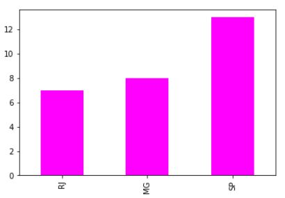

<p align="center"></p>

<h1><b><p align="center">Case</p></b></h1>
<p align="justify">Dado as tabelas TB_VENDEDOR e TB_VENDAS já compartilhadas , peço para que seja efetuada as seguintes tarefas.</br>
Lembrando que você poderá realizar o teste em excel, sheets, Power BI ou em qualquer ferramenta que tenha uma análise visual que respondam às perguntas abaixo.</p>

<ol>
<h2><li><b><p align="justify">Criar uma rotina de ETL (Integration Services), que importe a base de dados `baseDados.xlsx`.</p></b></li></h2>

```
def etl(dados):   
    df_vendedor = pd.read_excel(f'{dados}', sheet_name='TB_VENDEDOR')
    df_vendas = pd.read_excel(f'{dados}', sheet_name='TB_VENDAS')
    return (df_vendedor, df_vendas)
df = etl('TESTE PRATICO_BaseDados.xlsx')
```

<h2><li><b><p align="justify">No pacote criado, marcar um flag na tabela TB_VENDEDOR para os mesmos que forem do estado “PR”. Pois estes vendedores serão inválidos para nossa apuração e análise.</p></b></li></h2>

```
def etl(dados):
    
    df_vendedor = pd.read_excel(f'{dados}', sheet_name='TB_VENDEDOR')
    df_vendas = pd.read_excel(f'{dados}', sheet_name='TB_VENDAS')
    
    df_inner = pd.merge(df_vendas, df_vendedor, on='ID_VENDEDOR', how='left').reset_index(drop=True)
    mask = df_inner['ESTADO'] != 'PR'
    df = df_inner[mask]
    
    return df
df = etl('TESTE PRATICO_BaseDados.xlsx')
```

<h2><li><b><p align="justify">Faremos uma apuração das vendas por vendedor, em que geraremos um arquivo .csv contendo os campos ID_VENDEDOR, BONUS_R$.</p></b></li></h2>
Onde bônus será:</br>
Vendedor que a soma das vendas seja até R$ 1.000,00 (Bônus de R$ 500,00)</br>
Vendedor que a soma das vendas seja entre R$ 1.000,01 e R$ 2.000,00 (Bônus de R$ 750,00)</br>
Vendedor que a soma das vendas seja mais R$ 2.000,00 (Bônus de R$ 1000,00)</br>

```
df_3 = df.groupby('ID_VENDEDOR')[['VALOR_VENDA_R$']].sum().reset_index()
df_3['BONUS_R$'] = 0
for valor in range(len(df_3['VALOR_VENDA_R$'])):
    if df_3['VALOR_VENDA_R$'][valor] <= 1000:
        df_3['BONUS_R$'][valor] = 500
    elif 1000 < df_3['VALOR_VENDA_R$'][valor] <= 2000:
        df_3['BONUS_R$'][valor] = 750
    else:
        df_3['BONUS_R$'][valor] = 1000
df_3.drop(columns=['VALOR_VENDA_R$']).to_csv('Bonus')
```

<h2><li><b><p align="justify">Precisamos gerar os seguintes relatórios (Reporting Services, Power BI, Excel, ...)</p></b></li></h2>
<ol>
<h3><li><b><p align="justify">Qtd e total das vendas por estado;</p></b></li></h3>
<p align="center"></p>
<p align="center"></p>

<h3><li><b><p align="justify">Qtd e total das vendas por mês;</p></b></li></h3>
<p align="center"></p>
<p align="center"></p>


<h3><li><b><p align="justify">Por vendedor: A média do valor de vendas, quantos dias entre a primeira e última venda;</p></b></li></h3>
<p align="center"></p>

<h3><li><b><p align="justify">Exibir todas as vendas de cada vendedor, acumulando(somando) as vendas até aquele momento da venda</p></b></li></h3>
<p align="center"></p>
</ol>
</ol>
